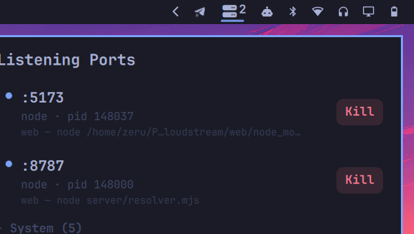

# Port Watch

Bar widget for [Omarchy](https://omarchy.org/) that shows the ports you're actually listening on, and lets you kill them.



## What it does

- Bar icon shows a live count of ports you started (dev servers, scripts, whatever).
- Click it to see each port, protocol, process name, pid, and the real command + folder it was launched from (read straight from `/proc`, not guessed).
- Kill button per row, needs a second click within 3s to confirm.
- GUI apps (browsers etc., detected via an actual Hyprland window match) and ports owned by other users/root are hidden by default, behind collapsible "Apps" / "System" sections.
- Widget hides itself entirely when you have nothing running.

## Install

```
omarchy plugin add https://github.com/ZerubbabelT/portwatch.git --enable
```

Or by hand:

```
git clone https://github.com/ZerubbabelT/portwatch.git ~/.config/omarchy/plugins/zeru.portwatch
omarchy-shell shell rescanPlugins
omarchy plugin enable zeru.portwatch
```

## Uninstall

```
omarchy plugin remove zeru.portwatch
```

Or by hand:

```
omarchy plugin disable zeru.portwatch
rm -rf ~/.config/omarchy/plugins/zeru.portwatch
omarchy-shell shell rescanPlugins
```

## Requirements

- Omarchy on Hyprland
- `ss` (part of `iproute2`, already installed on Omarchy)

## How it works

One `ss -tulpn` scan for ports, `hyprctl clients -j` to tell real windowed apps apart from headless processes, and a `/proc/<pid>` read for the exact command and working directory. No polling beyond a 15s background refresh (3s while the popup is open), no sudo, no network calls.

## License

MIT. See [LICENSE](LICENSE).
